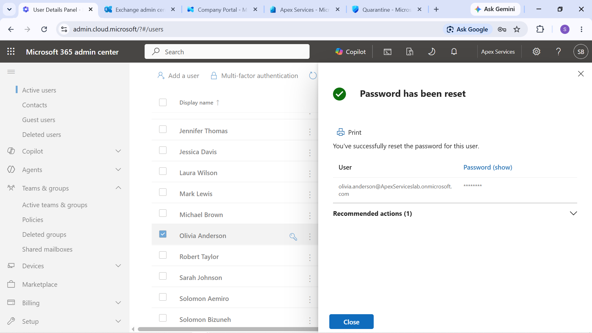

# Ticket 5 — Password Reset

## User

Olivia Anderson — Operations Assistant

## Issue

> "I can't sign in to my Microsoft 365 account because I forgot my password. Please reset it."

## Investigation

Olivia Anderson's account was identified and the password-reset process was initiated through Microsoft 365 administration.

A new temporary password was generated for the account.

## Password Reset

The administrator reset Olivia's password and provided the temporary credentials through the controlled lab workflow.

The user was then required to change the temporary password during sign-in.

Evidence: Olivia Anderson's password reset completed through Microsoft 365 administration.

## Login Verification

A private browser session was used to verify the user's ability to sign in with the reset credentials.

The sign-in process was completed successfully and the account prompted for the required password change.

Evidence: Olivia Anderson successfully signing in after the password reset.

## Verification

The account was tested after the reset to confirm that:

- The reset password allowed authentication
- The user could complete the required password change
- The Microsoft 365 account was accessible again

## Technician Resolution

> Reset Olivia Anderson's Microsoft 365 password after the user reported being unable to sign in. Verified successful authentication using the reset credentials and confirmed that the required password-change process was completed.

## Evidence Summary

| Evidence | Purpose |
|---|---|
| Password reset completed | Confirms the administrative reset |
| Login verified | Confirms that authentication was restored |

Support workflow:  
User Report → Identify Account → Reset Password → User Sign-In → Required Password Change → Verify Access