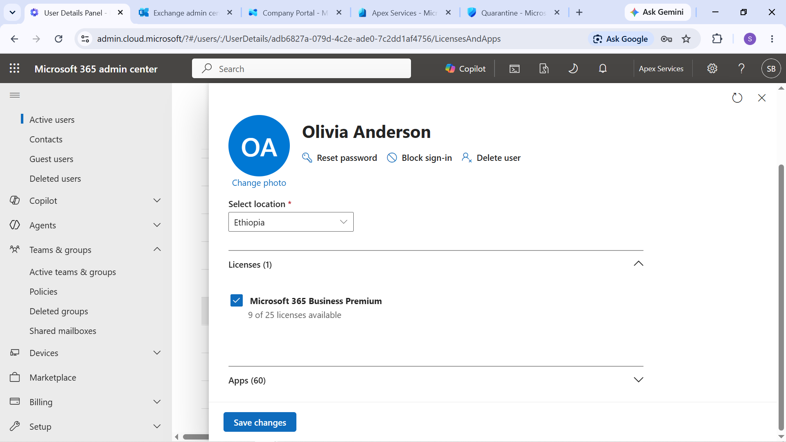

# Ticket 6 — Missing Microsoft 365 License

## User

Olivia Anderson — Operations Assistant

## Issue

> "I can't access my Microsoft 365 email and services. Please check whether my account has the required license."

## Investigation

Olivia Anderson's account was reviewed to establish the normal licensing state.

The account was initially assigned a Microsoft 365 Business Premium license.

Evidence: Olivia Anderson's baseline Microsoft 365 Business Premium license assignment.

The Business Premium license was then removed as a controlled change to reproduce the reported service-access problem.

Evidence: Business Premium license removed from Olivia Anderson's account.

The resulting service impact was then tested from the user's perspective.

Evidence: Outlook service impact following removal of the Microsoft 365 license.

## Diagnosis

The account's licensing configuration was reviewed and the missing Microsoft 365 Business Premium license was identified as the cause of the service-access problem.

Evidence: Investigation confirming the missing Microsoft 365 license.

## Resolution

The Microsoft 365 Business Premium license was restored to Olivia Anderson's account.

The account was then checked again to confirm that the required license was present.

Evidence: Microsoft 365 Business Premium license restored to Olivia Anderson.

## Verification

The restored license was verified through the Microsoft 365 account and a subsequent service-access test.

Evidence: Service access verified after the license was restored.

## Technician Resolution

> Investigated Olivia Anderson's inability to access Microsoft 365 services and identified that her Business Premium license had been removed. Restored the required license and verified that Microsoft 365 service access was restored.

## Evidence Summary

| Evidence | Purpose |
|---|---|
| License baseline | Establishes the expected licensing state |
| License removed | Demonstrates the controlled failure |
| Outlook impact | Shows the resulting service impact |
| License diagnosis | Identifies the missing license |
| License restored | Shows the corrective action |
| Restoration verified | Confirms service access was restored |

Support workflow:  
User Report → License Review → Controlled License Removal → Verify Service Impact → Diagnose → Restore License → Verify Access